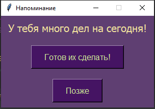
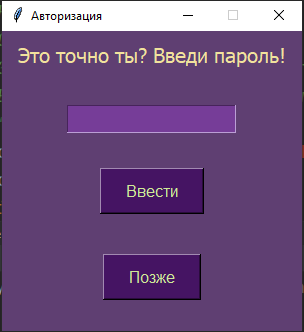
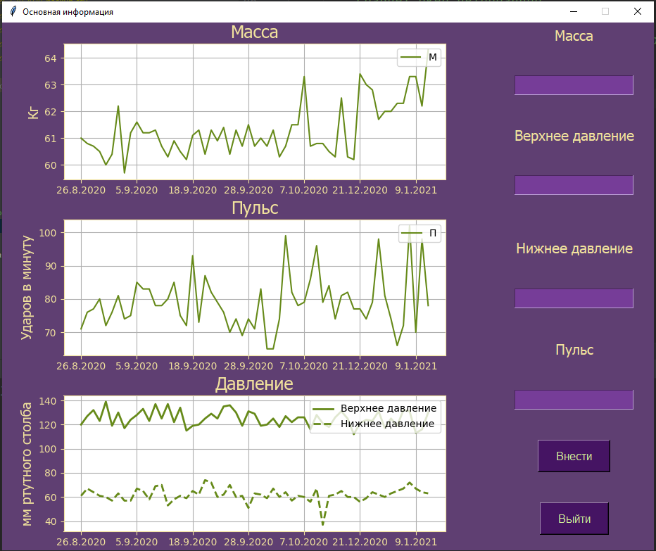

# It is a desktop application for daily health tracking and visualization.

### install:
1) install Python 3.9.2
2) install libraries from requirements.txt: `pip install requirements.txt`
3) run application from project directories:  
   for windows :cmd:`python main.py`,  
   for linux .

  
figure 1. Reminder window. 

  
figure 2. Authorization window. 

  
figure 3. main window. 

